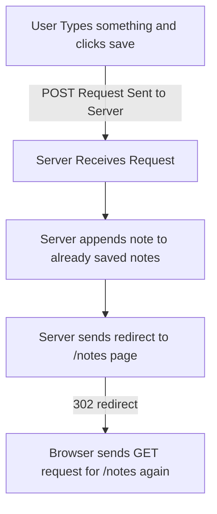

```mermaid
flowchart TD
    A[User Types something and clicks save] -->|POST Request Sent to Server| B[Server Receives Request]
    B --> C[Server appends note to already saved notes]
    C --> D[Server sends redirect to /notes page]
    D --> |302 redirect| E[Browser sends GET request for /notes again]
```