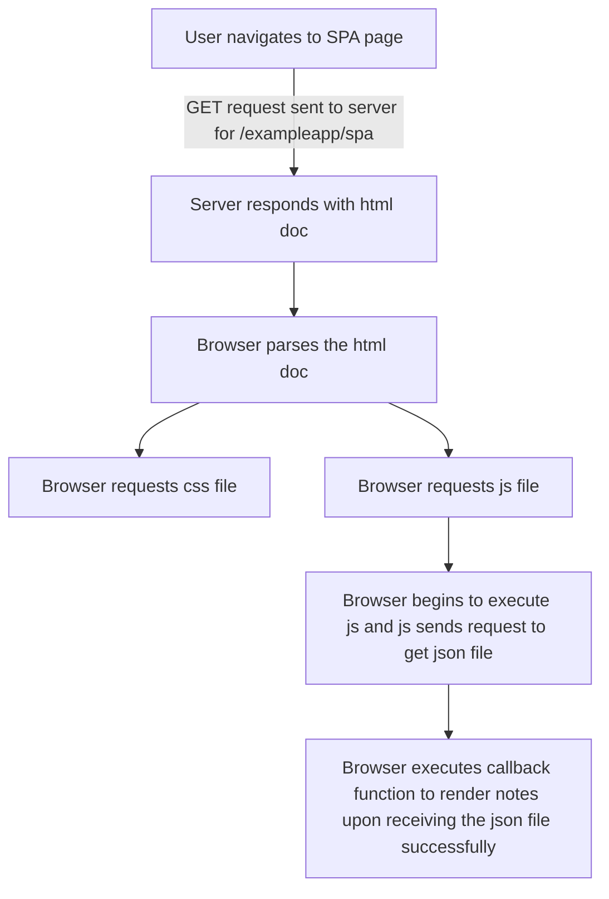

```mermaid
flowchart TD
    A[User navigates to SPA page] -->|GET request sent to server for /exampleapp/spa| B[Server responds with html doc]
    B --> C[Browser parses the html doc]
    C --> F[Browser requests css file]
    C --> G[Browser requests js file]
    G --> H[Browser begins to execute js and js sends request to get json file]
    H --> E[Browser executes callback function to render notes upon receiving the json file successfully]
```