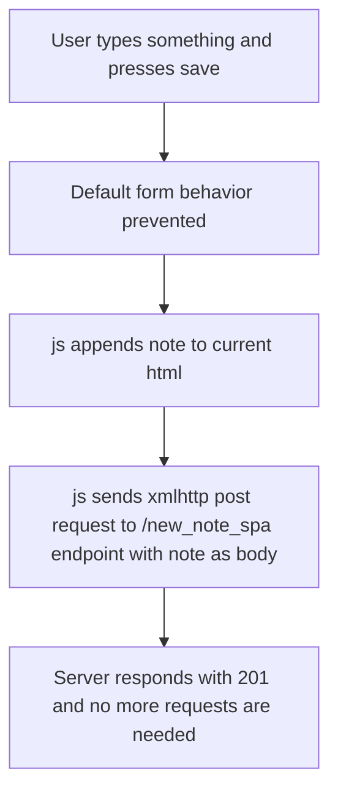

```mermaid
flowchart TD
    A[User types something and presses save] --> B[Default form behavior prevented]
    B --> C[js appends note to current html]
    C --> D[js sends xmlhttp post request to /new_note_spa endpoint with note as body]
    D --> E[Server responds with 201 and no more requests are needed]
```